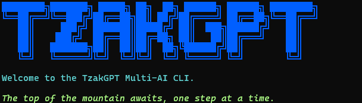

# TzakGPT — Multi AI CLI



*A terminal-based chat application powered by an AI model, built with Python and Rich library.*
 
 
## How It Works
 
### Single Model, No Racing
 
TzakGPT sends your message using **DeepSeek** (in my case, you can put whatever model you want) and returns its response, rendered as Markdown inside a Rich panel. Every response is timed, and the elapsed time is shown in the panel subtitle.
 
### File Awareness
 
TzakGPT is aware of your working directory — but only when it matters. When your message mentions files, folders, or extensions, the app scans your current directory and injects that information into the request automatically. No tokens are spent on file context unless your prompt actually needs it.
 
### Conversation Memory
 
All messages are saved to a `conversation_history` list in the format `{"role": ..., "content": ...}`. This history is passed to DeepSeek on every new prompt, so context is preserved across the entire session.
 
### Soul
 
TzakGPT's identity, file-awareness logic, and trigger keywords live in `soul.py` — separate from the UI and API logic. To change how TzakGPT thinks or reacts, that's the only file you need to touch.
 
## Project Structure
 
| File | Role |
|---|---|
| `main.py` | UI loop, input handling, rendering |
| `clients.py` | DeepSeek API call |
| `soul.py` | Identity, file context, trigger logic |
 
## Model Used
 
| Model | Provider |
|---|---|
| DeepSeek Chat | DeepSeek (via OpenAI-compatible API) |
 
---
 
## Setup
 
### Requirements
 
- Python 3.10+
- A DeepSeek API key
### Install dependencies
 
```bash
pip install -r requirements.txt
```
 
### Configure environment
 
Create a `.env` file in the project root:
 
```
DEEP_KEY=your_deepseek_api_key_here
```
 
### Run
 
```bash
python main.py
```
 
Type `exit` or `quit` to close the app.
 
---
 
## Notes
 
- Responses are rendered as Markdown inside a Rich panel.
- The panel subtitle shows the response time in seconds.
- The `!d` prefix switches the panel color to gold. `!f` resets it to blue.
- File context is injected on demand — zero extra tokens on normal messages.